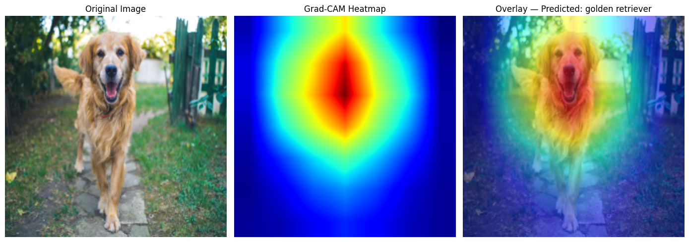

# Names: Jenessy Jane Lustre & Paul Hartman
# Lab: lab7 (Vision)
# Date: March 11, 2026

### Exercise 2
1. Filter 2 may be tracking warmer colors. Filter 4 appears to be measuring the brightness of the pixels. Filter 11 may be observing the contrast of pixels compared to surrounding ones.

2. Near-zero activation would imply that the area does not contain the pixels the filter is looking for. The filter would activate strongly is if the pattern is present throughout the image, such as in Filter 8.

### Exercise 3
3. There are less pixels represented in layer 4 than in layer 1. This indicates that as you go deeper, representations become more conceptual with the agent recognizing objects than abstract edges.

4. For our photos comparing a dog and a car, Layer 1 appears to differ more dramatically. The silhouette for the dog was not as defined as the car. Presumably, this could because the car had more distinct features such as smoother texture, harder edges, and more contrast against the background.

### Exercise 4

5. Looks like the heatmap focused heavily on the dog's head. The model classified it as a 'Golden Retriever' and the heat map focus more on the dog with a confidence level of 95.70%. From this we can conclude that the model has a high trustworthiness in this instance.

6. With classes that are similar like cats and dogs, the model would just have a lower confidence level if it was try to apply a cat heatmap on a dog image. 

If the classes differed more like a car heatmap, the confidence would be immensely lower and the heatmap may focus on odd things rather than than the dog.

### Exercise 5
7. That the model is relying on context information rather than direct understanding of the subject (taking a shortcut). In the zoo instance, the model may classify the bear as an another animal such as a lion if there is no snow present.

### Exercise 6
8. Even with the perturbation, the image still looks like a Golden Retriever. However the model changed its classification to an Irish Setter dog wih a confidence level of 49.8%.

The human eye can smooth out a lot of the noise we see but a model may interpret every pixel as important for classification. For instance, perturbation can make object edges less defined and thus it will make the model have a hard time recognizing them.

### Exercise 7
9. The model's confidence dropped below 50% at around ε ≈ 0.01.  This seems like a pretty small perturbation, so we may assume that the image of the Golden Retriever did not adhere too strongly to its respective decision boundary.

10. The most glaring risk is misclassification. In a medical diagnosis, if the classificcation is incorrect, that can lead to fatal decisions and ineffective treatment in general.

With this risk, you would want to know how robust a model is against attacks before you trust it. In an ideal model, you would want adversarial attempts to be less likely to change the subject class. And you would want the confidence level to drop accordingly to inform users. 

Furthermore in critical systems, you may even implement a threshold for confidence level, where if it is low enough, the model won't show a classification at all to not influence human judgement.

